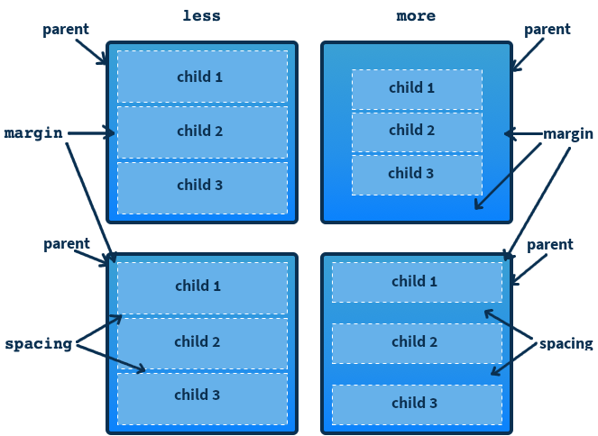

# macroquad ui
Evaluating Macroquad's immediate mode UI and comparing to common UI designs.

**References:**
* [Macroquad UI docs](https://docs.rs/macroquad/latest/macroquad/ui/index.html)

### Quick links
* [Overview](#overview)
  * [Clickable](#clickable)
  * [Draggable](#draggable)
  * [Layout](#layout)
  * [Scrollable](#scrollable)
  * [Stack overflow](#stack-overflow)
* [Layout management](#layout-management)
  * [Margins, padding and spacing](#margins-padding-and-spacing)
* [Ui](#ui)
* [Skin](#skin)
  * [Skin fields](#skin-fields)
* [Style](#style)
  * [StyleBuilder](#stylebuilder)
  * [Margins](#margins)
* [Widgets](#widgets)
  * [Button](#button)
  * [Checkbox](#checkbox)
  * [Combobox](#combobox)
  * [Editbox](#editbox)
  * [Group](#group)
  * [GroupToken](#grouptoken)
  * [InputText](#inputtext)
  * [Label](#label)
  * [Popup](#popup)
  * [Slider](#slider)
  * [Tabbar](#tabbar)
  * [Texture](#texture)
  * [TreeNode](#treenode)
  * [TreeNodeToken](#treenodetoken)
  * [Window](#window)
  * [WindowToken](#windowtoken)

## Overview
The UI entrypoint is `root_ui()`. You can dynamically create widgets through the root ui hook or 
create them in advance and pass the root ui into the widgets to draw themselves.

### Clickable
Goal: clickable and draggable rectangle with icon and label
* Implemented with static size/positioned button, texture and label
  * Not draggable as a unit  

### Draggable
Macroquad provides draggability through two components. Primarily this is done with the `Group` 
widget which contains other widgets and supports being dragged around the screen. Additionally the 
`Window` object is able to be moved by the window titlebar.

### Layout
Macroquad's `Group` is the primary means of laying out widgets in a moveable grouped unit. The group 
widget provides a new `0, 0` positional space to pack other widgets inside. Thus widget's being added 
can be positioned relative to the group's interior space. `Window` is the other means of laying out 
widgets providing automatic packing of widgets in the window's own `0,0` positional space.

### Scrollable
A `Group` will automatically scroll if its content exceeds the group's original size.

**Disable auto scrolling**  
Group's auto scrolling functionality can be disabled by setting the following styles changes
```rust
let scroll_width = 0.0;
let scroll_multiplier = 0.0;
let scrollbar_style = ui.style_builder().color(BLANK).color_hovered(BLANK).color_clicked(BLANK).build();
let scrollbar_handle_style = ui.style_builder().color(BLANK).color_hovered(BLANK).color_clicked(BLANK).build();
let skin = Skin {
    scrollbar_style,
    scrollbar_handle_style,
    scroll_width,
    scroll_multiplier,
    ..ui.default_skin()
};
```

### Stack overflow
If you don't use unique `Id` values you can get `stack overflow` errors. I ran into this issue when 
trying to next Group object wrappers. I wrote a struct method that instantiated a Macroquad group for 
me. Because the `hash!()` default implementation without any argument uses a concatenation of
`file!(), line!(), column!()` my implementation which has the same file, line, column combination 
for every call will internally cause Macroquad to recurse into oblivion. This can be solved by using 
a unique `Id` for each group instance.

## Layout management
Layout management objects provide policy and configuration to guide the automatic arrangement of 
child widgets within a parent widget including positioning and sizing dynamically for the available 
space. They are higher level constructs that allow you to move beyond exact postional coordinates.

**References**:
* [Qt Layout Management](https://doc.qt.io/qt-6/layout.html)
* [GTK4 Layout managers](https://blog.gtk.org/2019/03/27/layout-managers-in-gtk-4/)
* [GTK layout](https://itnext.io/understanding-gtk-layouts-13e5a36256fa)

### Start and End
Start and end layout locations


### Fill and expand
Fill consumes all space within its layout cell, but the layout cell itself doesn't expand; while 
expand changes the layout cell's size relative to other cells settings.


### Margins, padding and spacing
* ***Margins*** are additional space just outside the borders of the widget
* ***Padding*** is additional space just inside the borders of the widget and content
* ***Spacing*** is additional space between child widgets in the context of a parent widget



### Layout trait
All objects implemeting the `Widget` trait have a `Widget::set_layout(layout: impl Layout)` function 
that takes an object implementing the `Layout` trait to manage. This layout manager is used to 
layout the widget's children handling the positioning and resizing of the widget's children.

Layout managers centralize, consolodate and encapsulate the complexity of layout code allowing 
individual widgets to simply leverage this ability and don't need any container related properties 
at all.

### Layout types
Every application will need a `Root Layout` which is 

* Linear
  * lays out widges in a horiztonal row, from left to right or right to left
  * lays out widgets in a vertical column, from top to bottom or bottom to top
* Grid - lays out widgets in a two-dimenstional grid. Widgets can occupy multiple cells
* Form - lays out widgets in a 2-column label-field style

### Adding Widgets to a Layout


### Comparing various Ui designs
After rewriting sizing and positioning code multiple times I think it might make sense to see how
main stream UI tool kits have solved this.
* egui layout
  * starts from a base container
  * add layouts inside container and widgets inside layouts
  * defines frame as object controlling background fill and stroke
  * defines area as movable container
* Android layout management
  * Constraint layout
    * default layout in Android
    * TopToTopOf, TopToBottomOf, BottomToTopOf, LeftToTopOf, LeftToBottomOf, LeftToLeftOf
    * LeftToRightOf, LeftToTopOf...
  * Relative layout
    * positions widgets relative to each other
    * attributes
      * gravity
      * layout_above
      * layout_alignBottom, layout_alignLeft, layout_alignRight, layout_alignStart
      * layout_alignParentBottom, parentEnd, parentLeft, parentRight, parentStart, parentTop
      * centerHorizontal, centerInParent, centerVertical
  * Linear layout
    * horizontal or vertical
    * attributes
      * gravity
      * orientation
* [Gtk layout management](https://zetcode.com/gui/gtk2/gtklayoutmanagement/)
  * GtkAlignment
    * add an alignment config as the layout for another widget e.g. group.layout(Layout::l)
    * params
      * Horizontal alignment left or right
      * Vertical alignment top or bottom 
      * Horizontal expansion to fill up unused space
      * Vertical expansion to fill up unused space
  * GtkHBox - single row
  * GtkVBox - single column
  * GtkTable - arrange by rows and columns
* [WxWidgets Sizers](https://zetcode.com/gui/wxwidgets/layoutmanagement/)
  * WxBoxSizer
    * Vertical or Horizontal layout
    * `.add(<widget>)` to add 
    * border between widgets
    * left, right, top, bottom, all, expand
  * WxStaticBoxSizer
  * wxGridSizer
  * wxFlexGridSizer
  * wxGridBagSizer
* [Qt5 layout management](https://zetcode.com/gui/qt5/layoutmanagement/)
  * HBoxLayout
  * VBoxLayout
  * GridLayout
  * FormLayout
  * Enum AlignRight

## Ui
The `Ui` object is the type returned from `root_ui()` and provides creation functions for a number of 
widgets as well as functions for interacting with the ui.

* `button` - creates a new button instance
* `checkbox` - creates a new checkbox instance
* `combo_box` - creates a new combobox instance
* `drag` - ?
* `editbox` - creates a new editbox instance
* `group` - creates a new group instance
* `input_field` - creates a new input field instance
* `input_text` - creates a new input text instance
* `input_password` - creates a new input password instance
* `label` - creates a new label instance
* `calc_size` - calculates the actual rendered size of a label taking into account label style
* `popup` - creates a new popup window instance
* `separator` - ?
* `slider` - creates a new slider instance
* `tabbar` - creates a new tabbar instance
* `texture` - renders a textdure 2d object on the screen
* `tree_node` - ?
* `window` - create a new window instance
* `default_skin` - clones and returns the default skin
* `set_default_skin` - set the default skin
* `is_mouse_captured` - ?
* `is_mouse_over` - ?
* `active_window_focused` - ?
* `is_dragging` - ?
* `close_current_window` - ?
* `new_frame` - ?
* `render` - ?
* `focus_window` - ?
* `set_input_focus` - ?
* `clear_input_focus` - ?
* `move_window` - ?
* `same_line` - ?
* `canvas` - ?
* `push_skin` - push your custom skin on the stack to be used by anything drawn there after
* `pop_skin` - remove your custom skin from the skin stack to allow the previous skin to be used

## Skin
Macroquad uses a `Skin` to provide styling for the various UI compoments. The `Skin` object is 
composed of a `Style` object for each of the various widget types. Each style has various properties 
that can be set to change the widget's appearance when rendered.

### Skin fields
```rust
label_style: Style
button_style: Style
tabbar_style: Style
combobox_style: Style
window_style: Style
editbox_style: Style
window_titlebar_style: Style
scrollbar_style: Style
scrollbar_handle_style: Style
checkbox_style: Style
group_style: Style
margin: f32
title_height: f32
scroll_width: f32
scroll_multiplier: f32
```

## Style

### StyleBuilder
Styles can be build using the `StyleBuilder` object which exposes a number of configurable 
parameters.

```rust
pub fn font(self, ttf_bytes: &[u8]) -> Result<StyleBuilder, FontError>
pub fn background(self, background: Image) -> StyleBuilder
pub fn margin(self, margin: RectOffset) -> StyleBuilder
pub fn background_margin(self, margin: RectOffset) -> StyleBuilder
pub fn background_hovered(self, background_hovered: Image) -> StyleBuilder
pub fn background_clicked(self, background_clicked: Image) -> StyleBuilder
pub fn text_color(self, color: Color) -> StyleBuilder
pub fn text_color_hovered(self, color_hovered: Color) -> StyleBuilder
pub fn text_color_clicked(self, color_clicked: Color) -> StyleBuilder
pub fn font_size(self, font_size: u16) -> StyleBuilder
pub fn color(self, color: Color) -> StyleBuilder
pub fn color_hovered(self, color_hovered: Color) -> StyleBuilder
pub fn color_clicked(self, color_clicked: Color) -> StyleBuilder
pub fn color_selected(self, color_selected: Color) -> StyleBuilder
pub fn color_selected_hovered(self, color_selected_hovered: Color) -> StyleBuilder
pub fn color_inactive(self, color_inactive: Color) -> StyleBuilder
pub fn reverse_background_z(self, reverse_background_z: bool) -> StyleBuilder
pub fn build(self) -> Style
```

### Margins
The margin style property only has an effect if the static `<widget>.size()` function is not used. If 
a static size is given then the style `margin` and `background_margin` have no effect.


## Widgets

### Button

**Limitations**
* No support for changing label positioning inside the button

### Checkbox

### Combobox

### Editbox

### Group

### GroupToken

### InputText

### Label

### Popup
Borderless subwindow drawn on top overything

### Slider

### Tabbar

### Texture

### TreeNode

### TreeNodeToken

### Window

**Limitations**
Preserves a static location on the screen regardless of screen resizing. This is counter intuitive as 
typically widgets would reposition themselves in the same relative location when the window is 
resized.

### WindowToken

## Backlog

## Changelog
